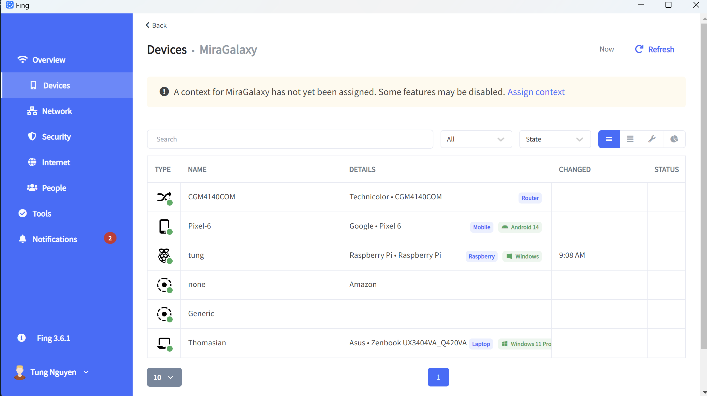

# comfyNeedle
Inspired by the phrase "finding needle in a haystack", the Needle project helps answer a question: How can a Raspberry Pi be easily discovered through multiple networks (namely wifi &amp; hotspots)

# Problem statement

Given:
A Raspberry Pi 4 + Bullseye (32-bit) Raspberry Pi OS 
2 network connections: wifi connection #1 (wlan0) & hotspot connection #2 (wlan1)

Question:
How to do it so that, accross the 2 networks, there exists a universal identification that allows for ease of SSH connection establishment with 100% reliability

# Approach 1 - static IP

An ip address has a form of A.B.C.D (A to D being number from 0-255)
On a network, all connected devices tend to have the same first 3 numbers (A.B.C being the same)
D is the differentiating factor

[read more about this](https://docs.oracle.com/cd/E19683-01/806-4075/ipref-1/index.html)

Currently, on wlan0, all devices have ip the form of 10.0.0.x

Following [Tom's hardware](https://www.tomshardware.com/how-to/static-ip-raspberry-pi), Raspberry Pi static ip can be set. Here are some interesting behaviors:

1. When setting static ip, ip address will remain accross all networks (wlan0 and wlan1). 

2. If the static IP has the first 3 numbers (10.0.0) matching the router's ip, SSH connection is successful. If not, Raspberry Pi connection cannot be discovered by other devices -> no SSH established. However, web browsing on RPi is possible in both cases.

Edge case discovered: if a static IP is set for wlan0, it will also be applied for wlan1, causing SSH failure on wlan1.

Potential solution: Setting the last digit (D in 1.B.C.D) static.

This will work on a small-scale situation where IP overlapping is not likely, but not an industrial setting

Conclusion: not to be pursued unless no other way

# Approach 2: Device information

This is a screenshot from Fing, a network scanning application.

It shows that the Raspberry Pi, once connected to wifi, can be scanned for hostname & details (manufacturer name).

If we accept that network info (hostname & ip) are unreliable for the application, perhaps these details can be of use.

After digging into python socket library, there's something called "alias" that can be attached to a Raspberry Pi config.

Refer to the approach-2/device-scan.py file for more details

Currently seems promising, but scanning process takes a long time (the more devices on network, the longers)

Conclusion: This is not standardized, not easy to implement in Flutter without Native Codes. Moreover, scanning for IP addresses & reading into the details takes a long time (~7s) -> not viable

# Approach 3: The classic, just improved

Currently, SSH identification is done using both hostname & IP address

- Establishing initial OS image:
    
    Add wifi (priority 1) & hotspot (priority 2) information 
- When host info is added: 
    
    <code>Map{String, String} id = {} in format {SSID, ip_addr}</code>

    <code>hostname = given_hostname; ip[current_SSID] = get_ip_addr(given_hostname) </code>

    Then, finish adding project!

- When opening project:

    <code>SSH.establish(ip[current_SSID])
    if (failed) SSH.establish(hostname) && (current_SSSID)=get_ip_addr(hostname)</code>

# Approach 4: Perhaps a transition to Raspberry Pi Pico W is a good idea?